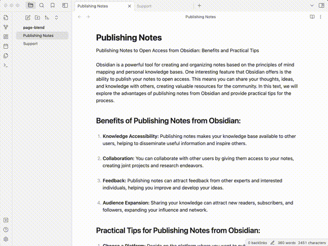
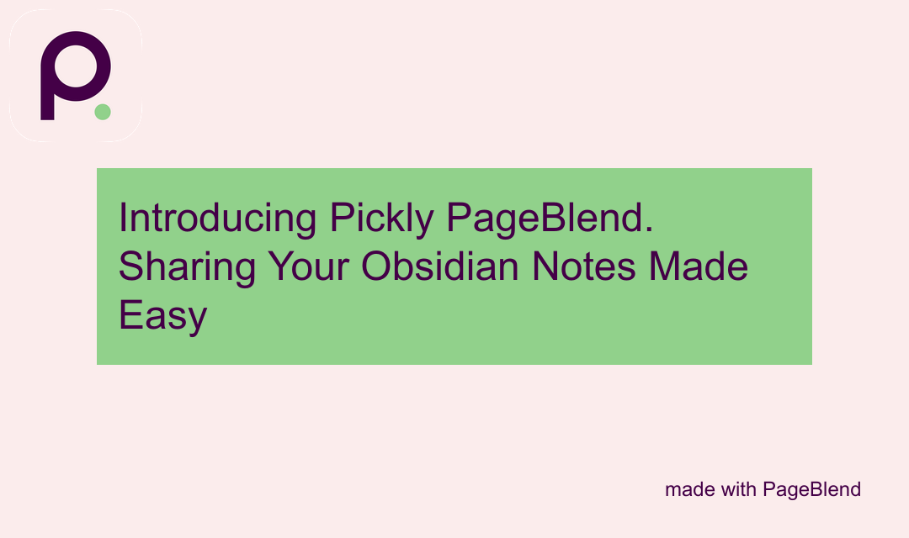
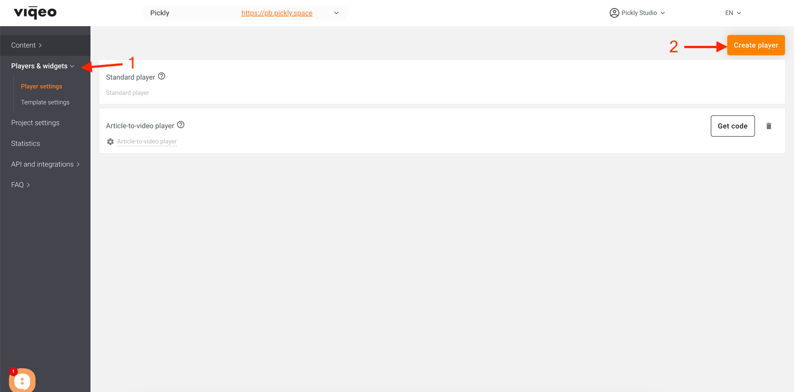
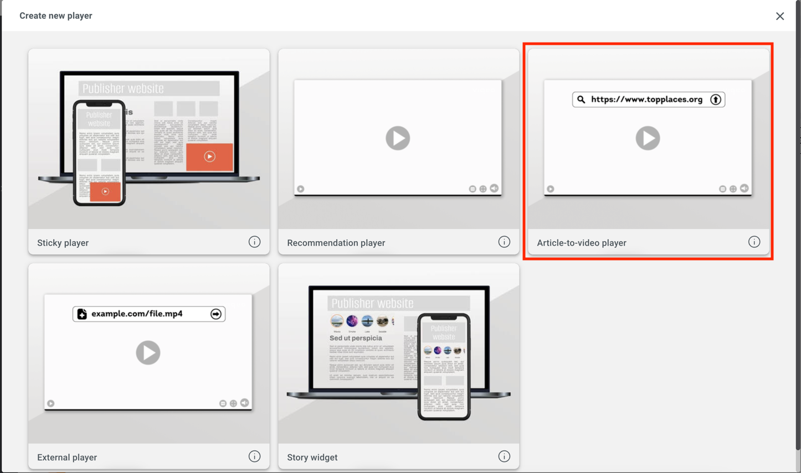
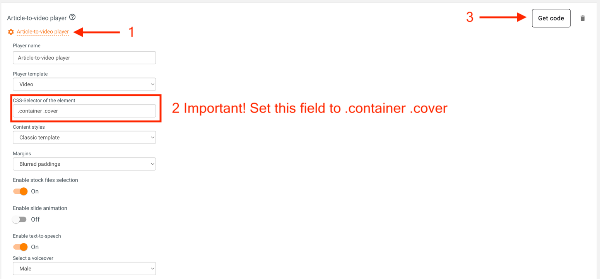
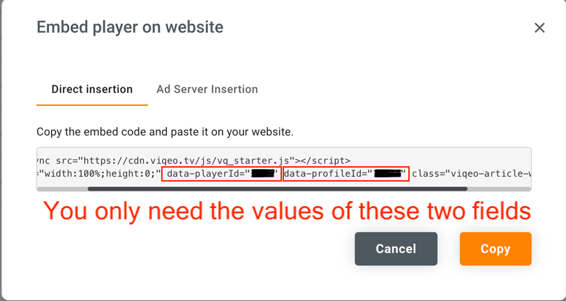

# Pickly PageBlend

Pickly PageBlend - the easiest way to share your Obsidian notes.

## Features

- Note publication
- Markdown syntax support
- Publication of linked notes and files
- Permanent link to files
- Beautiful social media previews
- Create a video from the text of your note and publish it directly on the page (works through [Viqeo.tv Article-to-video player](https://viqeo.tv/article-to-video-player), there is a free plan)

## Usage

You can publish your notes in several ways:

- Just press `Command+Shift+P` (`Ctrl+Shift+P` if you are using Windows/Linux)
- Through the file context menu. Open the file context menu and click "Publish with PageBlend."
- Through a command. To do this, execute the command "Pickly PageBlend: Publish with PageBlend."
 
Wait for the note to be published, after which you will receive a link to the published file.



## Preview

The preview image of your note will be set to the first image from the note.

If there are no images in your article, an image containing the title of your article will be automatically created. For example: 



## Meta tags

By default, the note title will be used as the meta tags for your page.

You can change the meta tags by specifying the properties of your note.

```
---
pickly_title: Your custom title for <meta property="og:title"> and other.
pickly_description: Your custom description for <meta name="description"> and other.
---
```

The title of the page will always match the title of your note.

## Note to video

> **Video is created automatically within 10-15 minutes. After publishing, open your page in a browser, opening the page will start the video creation process.**

Create a video from your note with [Viqeo and Article-To-Video Player](https://viqeo.tv/article-to-video-player).

Example: [https://pb.pickly.space/pages/article-to-video-example.html](https://pb.pickly.space/pages/article-to-video-example.html)

You need:
1. create an account on [Viqeo.tv](https://studio.viqeo.tv)
2. Add article-to-video player


3. Customize it
> **Important! Set the "CSS-Selector of the element" field to** `.container .cover`


4. Get the player's embed code

5. Add options to your note properties

```
pickly_ttv: yes
viqeo_player_id: 123
viqeo_profile_id: 321
```

The `pickly_ttv` field says that you want to generate a video from your note. It should always equal `yes`.

In the `viqeo_player_id` field, enter your player id from the embed code, `data-playerId` field.

In the `viqeo_profile_id` field, enter the profile ID from the embed code, `data-profileId` field.

Publish your note and wait for the video to be created!

## Installing

The plugin is still under approval. Only manual installation available.

## Manual installation

1. Download the latest release
2. Extract the `pickly-page-blend` folder from the zip to your vault's plugins folder: <vault>/.obsidian/plugins/
   > Note: On some machines the `.obsidian` folder may be hidden. On MacOS you should be able to press `Command+Shift+Dot` to show the folder in Finder.
3. Reload Obsidian
4. If prompted about Safe Mode, you can disable safe mode and enable the plugin.

## License

MIT License

## Support

I developed this project in my free time. I use this plugin in my everyday life and am very satisfied with it. It has been an engaging journey for me, and I hope my work will also benefit you. The project is entirely free and will remain so. However, if you decide to show your appreciation for this work, I would be very grateful to you.

<a href='https://ko-fi.com/B0B7OB311' target='_blank'></a>
